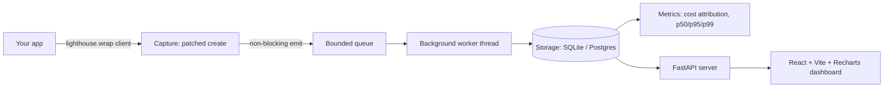

# Lighthouse

Observability for LLM apps: request traces, token costs, latency percentiles, and side-by-side prompt-version diffs. Think Datadog, but for the failure modes that are specific to LLM calls.

## Architecture

## Design decisions

1. **Non-blocking capture is the core constraint.** `wrap()` patches `client.chat.completions.create` (or `client.messages.create`) on the instance, times the real call, and on every path (success, error, or a storage outage) hands a record to a bounded in-memory queue via `queue.put_nowait` -- no I/O on the caller's thread. A single background daemon thread drains the queue and writes to storage; if storage raises, the worker swallows it. If the queue is full, the record is dropped rather than blocking. Measured overhead: **~0.006ms/call** added on top of a baseline call (500-call benchmark, `python examples/measure_overhead.py`) -- the proof this is safe to run in production.
2. **Ergonomics tradeoff: instance patching over a subclass or context manager.** `lighthouse.wrap(client)` mutates the client instance in place and returns it, so existing code (`client.chat.completions.create(...)`) is untouched -- the integration is genuinely ≤3 lines. The cost is that it relies on duck-typing the SDK's shape (`.chat.completions` vs `.messages`) rather than a stable public interception hook, so a major SDK restructure could break it. A decorator-based API was considered but rejected: it would require wrapping every call site instead of once at client construction.
3. **Cost attribution from a maintained pricing table, not the provider's bill.** Token counts come straight off `response.usage`; `lighthouse/pricing.py` maps `model -> $/1M tokens` and computes cost at capture time, so historical costs stay stable even if pricing changes later. Unknown models fall back to a default rate instead of raising. `lighthouse.metrics.cost.compare_to_invoice()` is the hook for reconciling computed cost against a real provider invoice.
4. **Percentiles via nearest-rank, not interpolation.** `p50/p95/p99` use the standard nearest-rank method (sort, take the `ceil(p*n)`th value) because it's deterministic and easy to verify against known inputs in tests -- unlike interpolation-based percentile conventions, which vary.
5. **One SQLAlchemy backend, not two.** "Storage behind an interface" is implemented as a single `Storage` class whose dialect lives entirely in the connection URL -- SQLite locally, Postgres in prod -- rather than hand-maintaining parallel query layers. Swapping backends is a config change (`LIGHTHOUSE_DATABASE_URL`), not a code change.
6. **Trace grouping via a contextvar, not explicit ID-threading.** `with lighthouse.trace("op"):` sets a context-local trace id that every wrapped call picks up automatically, including across `await`/thread-local boundaries via `contextvars`. Calls made outside any `trace()` block still get a trace (one-off, auto-minted) so every call always belongs to exactly one trace.
7. **Prompt versioning is append-only.** `lighthouse.prompt(name).new_version(template)` always creates a new immutable row (auto-incrementing version) rather than mutating in place -- so a previous version's captured outputs are never retroactively orphaned, which is what makes the diff view trustworthy.

## Limitations & Future Work

- **No automated regression detection.** This is the headline next feature: today Lighthouse ships the prompt-version **diff viewer** -- it shows a human exactly what changed -- but doesn't statistically flag when an output silently degrades. Real regression detection needs a quality metric and a statistical baseline (e.g. embedding-similarity drift, an LLM-as-judge score, or human-labeled golden sets) compared across versions with confidence bounds, which is its own multi-week project.
- **Cost-attribution accuracy is unverified against a real invoice.** The pricing table and `compare_to_invoice()` method exist; running it against an actual provider bill to confirm the computed totals match is still pending.
- **Only OpenAI's `chat.completions` and Anthropic's `messages` are wrapped** -- not streaming responses, the Responses API, or embeddings endpoints.
- **No auth on the dashboard/API.** Fine for local/portfolio use; would need an auth layer before being multi-tenant or internet-facing.
- **SQLite is single-writer.** Fine for dev and the example app; concurrent production workloads should set `LIGHTHOUSE_DATABASE_URL` to Postgres.
